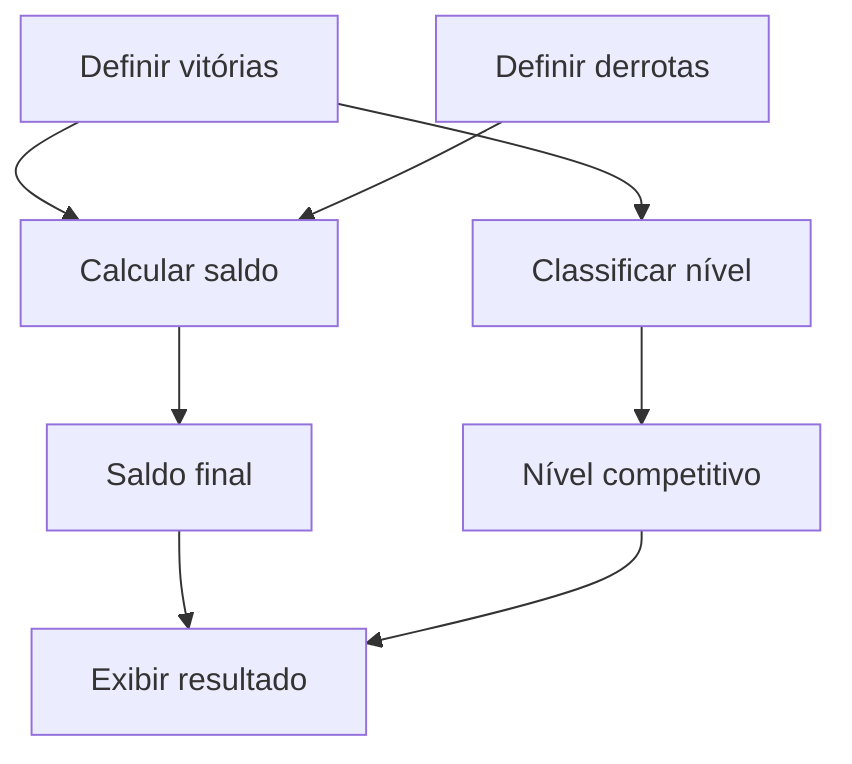

<div align="center">

# 🎮 Calculadora de Partidas Ranqueadas

Desafio de lógica de programação desenvolvido em JavaScript para calcular o saldo de partidas de um jogador e classificar seu nível competitivo.


</div>

---

## 📌 Sobre o projeto

Este projeto implementa uma calculadora de partidas ranqueadas utilizando JavaScript.

O programa recebe a quantidade de vitórias e derrotas de um jogador, calcula o saldo das partidas e determina seu nível competitivo com base na quantidade total de vitórias.

A lógica principal utiliza duas funções:

* `calcularSaldo`: calcula a diferença entre vitórias e derrotas;
* `classificarNivel`: determina o nível do jogador.

Ao final, o programa apresenta uma mensagem com o saldo e a classificação alcançada.

Exemplo:

```text
O Herói tem saldo de 55 e está no nível Ouro
```

O projeto foi desenvolvido como parte de um desafio da **Digital Innovation One — DIO**, com foco nos fundamentos da lógica de programação.

---

## 🎯 Objetivos

Os principais objetivos deste desafio são:

* praticar criação de funções;
* trabalhar com parâmetros e retornos;
* utilizar operadores aritméticos;
* utilizar operadores relacionais;
* aplicar estruturas condicionais;
* classificar valores por intervalos;
* separar responsabilidades no código;
* exibir resultados com template strings;
* executar JavaScript com Node.js.

---

## 🧠 Regras do desafio

O saldo é calculado pela seguinte fórmula:

```text
saldo = vitórias - derrotas
```

O nível é definido pela quantidade total de vitórias:

| Quantidade de vitórias | Nível    |
| ---------------------: | -------- |
|                 Até 10 | Ferro    |
|             De 11 a 20 | Bronze   |
|             De 21 a 50 | Prata    |
|             De 51 a 80 | Ouro     |
|             De 81 a 90 | Diamante |
|            De 91 a 100 | Lendário |
|           Acima de 100 | Imortal  |

> O saldo é apresentado na mensagem final, mas a classificação utiliza a quantidade de vitórias.

---

## 🔄 Funcionamento

O fluxo do programa pode ser representado da seguinte forma:



---

## 🧮 Cálculo do saldo

A função `calcularSaldo` recebe dois parâmetros:

* quantidade de vitórias;
* quantidade de derrotas.

```javascript
function calcularSaldo(vitorias, derrotas) {
    return vitorias - derrotas;
}
```

Exemplo:

```javascript
const saldo = calcularSaldo(75, 20);

console.log(saldo);
```

Resultado:

```text
55
```

---

## 🏆 Classificação do nível

A função `classificarNivel` recebe a quantidade de vitórias e verifica em qual intervalo o jogador se encontra.

```javascript
function classificarNivel(vitorias) {
    let nivel;

    if (vitorias <= 10) {
        nivel = "Ferro";
    } else if (vitorias <= 20) {
        nivel = "Bronze";
    } else if (vitorias <= 50) {
        nivel = "Prata";
    } else if (vitorias <= 80) {
        nivel = "Ouro";
    } else if (vitorias <= 90) {
        nivel = "Diamante";
    } else if (vitorias <= 100) {
        nivel = "Lendário";
    } else {
        nivel = "Imortal";
    }

    return nivel;
}
```

Como as condições são verificadas em ordem crescente, não é necessário repetir o limite inferior em cada `else if`.

---

## 🧪 Exemplo de uso

```javascript
const vitorias = 75;
const derrotas = 20;

const saldoVitorias = calcularSaldo(vitorias, derrotas);
const nivel = classificarNivel(vitorias);

console.log(
    `O Herói tem saldo de ${saldoVitorias} e está no nível ${nivel}`
);
```

Saída:

```text
O Herói tem saldo de 55 e está no nível Ouro
```

---

## 🛠️ Tecnologias utilizadas

| Tecnologia | Aplicação                 |
| ---------- | ------------------------- |
| JavaScript | Implementação da lógica   |
| Node.js    | Execução do programa      |
| Git        | Controle de versão        |
| GitHub     | Hospedagem e documentação |
| VS Code    | Desenvolvimento do código |

---

## 📁 Estrutura do repositório

```text
Desafio-Calculadora-De-Partidas-Ranqueadas-DIO/
│
├── CalculadoraDePartidasRankeadas.js
└── README.md
```

| Arquivo                             | Descrição                       |
| ----------------------------------- | ------------------------------- |
| `CalculadoraDePartidasRankeadas.js` | Código principal da calculadora |
| `README.md`                         | Documentação do desafio         |

---

## 🚀 Como executar

### Pré-requisitos

Para executar o projeto, é necessário possuir:

* Git;
* Node.js;
* terminal ou Prompt de Comando.

### 1. Clone o repositório

```bash
git clone https://github.com/ONestoDev/Desafio-Calculadora-De-Partidas-Ranqueadas-DIO.git
```

### 2. Acesse a pasta

```bash
cd Desafio-Calculadora-De-Partidas-Ranqueadas-DIO
```

### 3. Execute o programa

```bash
node CalculadoraDePartidasRankeadas.js
```

### 4. Confira a saída

Com os valores atuais:

```javascript
const vitorias = 75;
const derrotas = 20;
```

O resultado será:

```text
O Herói tem saldo de 55 e está no nível Ouro
```

---

## 🧪 Testando outros cenários

### Jogador Ferro

```javascript
const vitorias = 8;
const derrotas = 3;
```

Resultado:

```text
O Herói tem saldo de 5 e está no nível Ferro
```

### Jogador Diamante

```javascript
const vitorias = 85;
const derrotas = 30;
```

Resultado:

```text
O Herói tem saldo de 55 e está no nível Diamante
```

### Jogador Imortal

```javascript
const vitorias = 120;
const derrotas = 35;
```

Resultado:

```text
O Herói tem saldo de 85 e está no nível Imortal
```

---

## 🧩 Conceitos praticados

### Funções

Funções permitem separar e reutilizar partes da lógica.

```javascript
function calcularSaldo(vitorias, derrotas) {
    return vitorias - derrotas;
}
```

### Parâmetros

Os parâmetros representam os valores recebidos pela função:

```javascript
vitorias
derrotas
```

### Retorno

O comando `return` devolve o resultado:

```javascript
return vitorias - derrotas;
```

### Estruturas condicionais

As estruturas condicionais escolhem uma classificação conforme a quantidade de vitórias.

```javascript
if (vitorias <= 10) {
    return "Ferro";
}
```

### Template strings

As template strings permitem inserir valores em uma mensagem:

```javascript
console.log(
    `O Herói tem saldo de ${saldo} e está no nível ${nivel}`
);
```

---

## ✅ Versão aprimorada

Uma versão mais segura pode validar os dados antes de realizar os cálculos:

```javascript
function validarNumero(valor, campo) {
    if (!Number.isFinite(valor) || valor < 0) {
        throw new Error(
            `${campo} deve ser um número maior ou igual a zero.`
        );
    }
}

function calcularSaldo(vitorias, derrotas) {
    validarNumero(vitorias, "Vitórias");
    validarNumero(derrotas, "Derrotas");

    return vitorias - derrotas;
}

function classificarNivel(vitorias) {
    validarNumero(vitorias, "Vitórias");

    if (vitorias <= 10) return "Ferro";
    if (vitorias <= 20) return "Bronze";
    if (vitorias <= 50) return "Prata";
    if (vitorias <= 80) return "Ouro";
    if (vitorias <= 90) return "Diamante";
    if (vitorias <= 100) return "Lendário";

    return "Imortal";
}

const vitorias = 75;
const derrotas = 20;

const saldo = calcularSaldo(vitorias, derrotas);
const nivel = classificarNivel(vitorias);

console.log(
    `O Herói tem saldo de ${saldo} e está no nível ${nivel}`
);
```

Essa versão:

* rejeita valores negativos;
* rejeita valores não numéricos;
* reduz condições repetidas;
* mantém as funções reutilizáveis;
* facilita a criação de testes.

---

## ⚠️ Limitações

A implementação atual possui finalidade educacional e apresenta algumas limitações:

* os valores são definidos diretamente no código;
* apenas um jogador é processado por execução;
* não existe entrada pelo terminal;
* não existe interface gráfica;
* não há testes automatizados;
* valores negativos não são validados;
* o nome do jogador não é armazenado;
* os dados não são persistidos.

---

## 🗺️ Possíveis melhorias

O projeto poderá evoluir com:

* entrada de dados pelo terminal;
* cadastro do nome do jogador;
* validação de números;
* processamento de vários jogadores;
* ranking com arrays;
* criação de testes automatizados;
* interface web com HTML e CSS;
* formulário interativo;
* histórico de partidas;
* cálculo de taxa de vitória;
* separação da lógica em módulos.

---

## 📊 Possível cálculo de taxa de vitória

Além do saldo, o programa pode calcular a taxa de vitória:

```javascript
function calcularTaxaDeVitoria(vitorias, derrotas) {
    const total = vitorias + derrotas;

    if (total === 0) {
        return 0;
    }

    return (vitorias / total) * 100;
}
```

Exemplo:

```javascript
const taxa = calcularTaxaDeVitoria(75, 20);

console.log(`Taxa de vitória: ${taxa.toFixed(2)}%`);
```

Essa funcionalidade não faz parte do desafio original, mas pode ser utilizada como evolução futura.

---

## 📚 Aprendizados desenvolvidos

Durante o desafio foram praticados:

* sintaxe do JavaScript;
* variáveis;
* constantes;
* funções;
* parâmetros;
* retornos;
* operadores aritméticos;
* operadores relacionais;
* estruturas condicionais;
* intervalos numéricos;
* template strings;
* execução com Node.js;
* separação de responsabilidades.

---

## 🎓 Contexto educacional

Projeto desenvolvido durante o desafio **Calculadora de Partidas Ranqueadas**, disponibilizado pela **Digital Innovation One — DIO**.

O repositório faz parte dos estudos iniciais de lógica de programação e JavaScript.

---

## 👨‍💻 Autor

Desenvolvido por **Ernesto — ONestoDev**.

[](https://github.com/ONestoDev)

---

## 📄 Licença

Este projeto possui finalidade educacional.

Os materiais e o enunciado original pertencem à instituição responsável pelo desafio.
